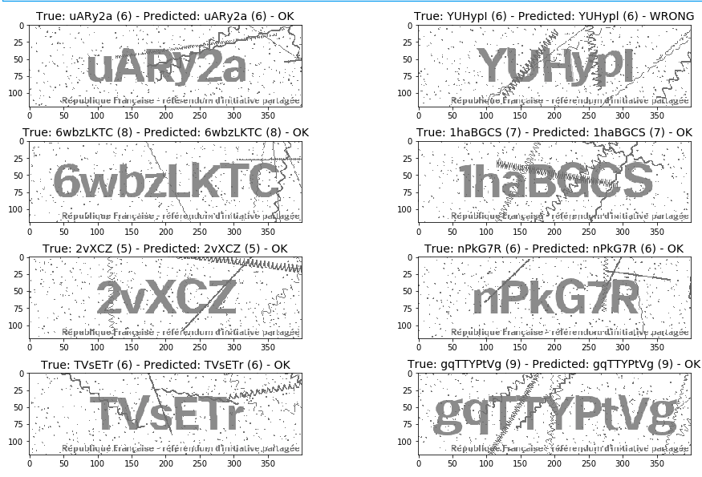

# captchanet

[](https://travis-ci.com/hadim/captchanet)

A simple but yet efficient neural networks to solve captcha images.

Features:

- Generate your own dataset of random captcha images: no need to manually annotate a dataset, you only need to generate images as close as possible as the real ones.
- Use Tensorflow 2.0 and the Keras API.
- After training, model is exported as a Keras HDF5 model (soon it will be exported as a Saved Model file).
- Model can be loaded in an environment containing only Tensorflow. Useful for inference (no need to install the `captachanet` library).



## Install

Dependencies should be installed using Anaconda:

```bash
conda create -n captchanet_env
conda activate captchanet_env
conda env update -f environment.yml

# Then install libraries not available in conda-forge.
pip install --no-deps -U tensorflow-datasets tensorflow_metadata tensorboard tensorflow-estimator
pip install --no-deps -U tensorflow-gpu==2.0.0-beta1
pip install --no-deps -U https://github.com/keras-team/keras-tuner/archive/fe5ed591bf54fc3db033814ab43193f6e8999ee5.zip
```

Then install captchanet:

`pip install captchanet`

## Usage

As a starting point you can browser [the notebooks](./notebooks) and adapt it to our needs.

## License

Under BSD license. See [LICENSE](LICENSE).

## Authors

- Hadrien Mary <hadrien.mary@gmail.com>
